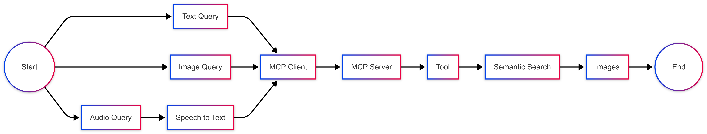
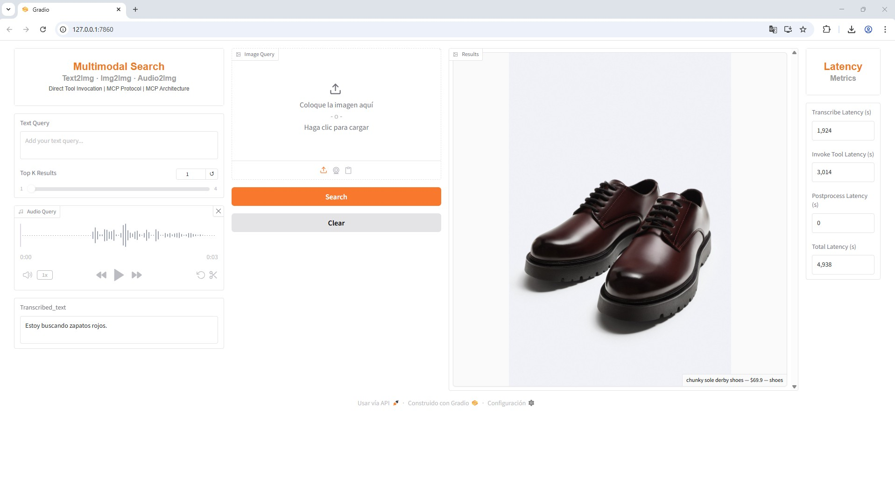
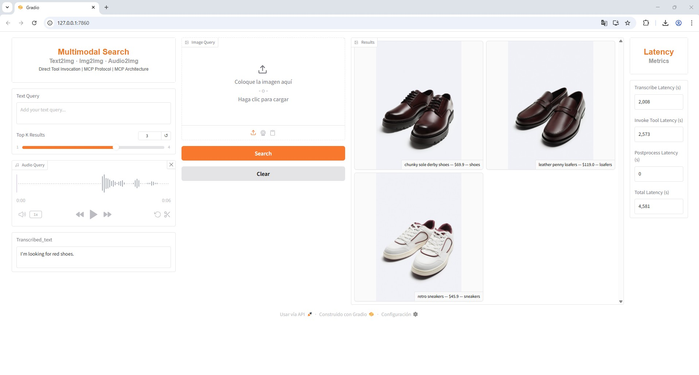
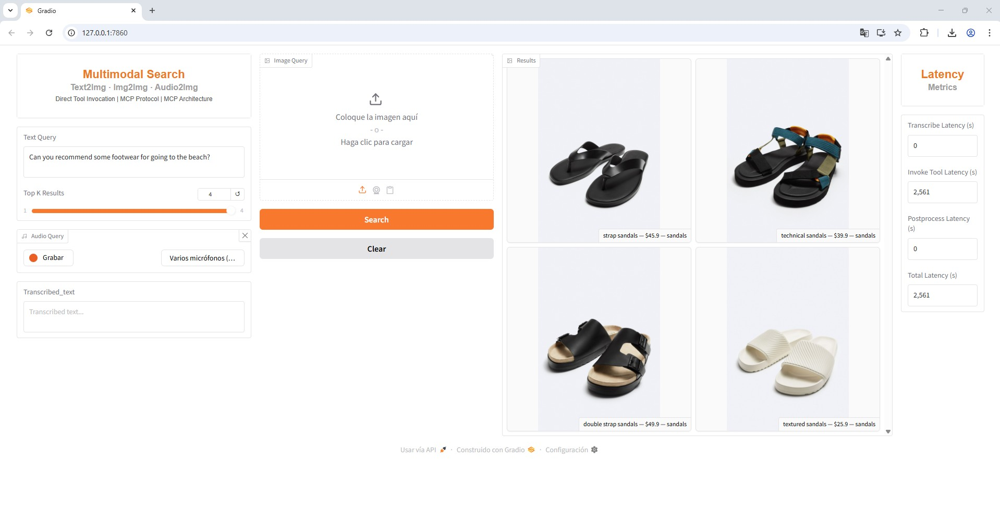

# Low Latency Multimodal Search Web App with MCP Architecture

## Introduction
Imagine being able to search for the perfect pair of shoes not just by typing a few keywords, but by speaking a description or simply showing an image. This project brings that idea to life through a multimodal search web application built on an MCP-based architecture. By blending voice, text, and image queries into a single experience, the system allows users to explore a footwear image database in a more natural and human way, turning search from a rigid task into an intuitive conversation with data.

## Key Features
- 🔌 MCP Client–Server architecture
- 🧠 Vector search with ChromaDB (multimodal embeddings)
- 🛠️ Explicit MCP tool invocation (no agent)
- 🎧 Audio transcription using faster-whisper (Multilingual LLM)
- 📊 Latency metrics: Transcription latency, MCP tool latency , Item post-processing latency
- 🖥️ Interactive Gradio UI


## Goal
The goal of this project is to build a web application for multimodal search using an MCP (Multimodal Conversational Platform) architecture. The solution allows users to perform queries via voice, text, or image over a database of footwear images and their metadata. Through this application, users can search for products (e.g., footwear) and get relevant results based on different query modalities.

The main goal of this project is to demonstrate how a multimodal search system can benefit from MCP architecture and how libraries like faster-whisper improve the latency of audio-to-text conversion compared to OpenAI's Whisper models


## Architecture
The system is designed around a high-level architecture that provides a clear overview of all components and their interactions. The frontend web application allows users to perform multimodal searches using text, image, or audio inputs by invoking tools exposed by the MCP Server through an MCP Client. It also includes a latency monitoring panel, a results gallery, speech-to-text transcription for voice queries, and controls to select the number of returned results.

At the core of the system, a vector database (ChromaDB) stores image embeddings along with their metadata and enables similarity-based retrieval for user queries. The MCP Server exposes multiple tools via the MCP protocol, including text-to-image and image-to-image search, which connect the frontend with the vector database to deliver relevant search results efficiently


## Flow Diagram
This diagram outlines how the system operates at a high level. The user submits a query (text, image, or audio), which is sent to the MCP Client. The MCP Client then invokes the corresponding tool exposed by the MCP Server. The server’s tools perform semantic searches on a vector database, retrieving images relevant to the user’s query.


 
 
## Sequence Diagram

The sequence diagram illustrates how the different system components communicate and interact over time during a search request. It shows the end-to-end flow from the user submitting a multimodal query (text, image, or audio) through the frontend, MCP Client, and MCP Server, to the execution of the appropriate search tool and the retrieval of results from the vector database. This diagram highlights the sequential interactions and decision points that enable multimodal processing and result delivery.

 


## Demo

### Voice Query Example








### Image Query Example


### Text Query Example




## Tech Stack


* **Gradio UI** for the frontend interface.
* **Docker** for containerization and deployment.
* **MCP Client/Server** communication via the **MCP protocol**.
* **ChromaDB** for efficient vector-based search and retrieval.
* **faster-whisper** for Speech-to-Text conversion.


# Getting Started

## Project Structure
The project is organized in a modular architecture to ensure clear separation of concerns:
```bash
MULTIMODAL_SEARCH_MCP_ARCHITECTURE/
├── frontend/                        # Frontend application directory
│   ├── .venv                        # Virtual environment for frontend dependencies
│   ├── .env                         # Environment variables for frontend
│   ├── .env.example                 # Example environment variables for frontend
│   ├── src                          # Source code for the frontend application
│   ├── .dockerignore                # Files to exclude from Docker container (for frontend)
│   ├── main.py                      # Main entry point for the frontend application
│   ├── setup.py                     # Setup script for frontend dependencies
│   ├── requirements.txt             # List of Python dependencies for the frontend
│   ├── Dockerfile                   # Container configuration for the frontend
│   └── README.md                    # Documentation for the frontend
│
├── mcp_server/                      # MCP server application directory
│   ├── .venv                        # Virtual environment for server dependencies
│   ├── .env                         # Environment variables for the MCP server
│   ├── .env.example                 # Example environment variables for MCP server
│   ├── src                          # Source code for the MCP server
│   ├── .dockerignore                # Files to exclude from Docker container (for MCP server)
│   ├── main.py                      # Main entry point for the MCP server application
│   ├── setup.py                     # Setup script for MCP server dependencies
│   ├── requirements.txt             # List of Python dependencies for the MCP server
│   ├── Dockerfile                   # Container configuration for the MCP server
│   └── README.md                    # Documentation for the MCP server
│
├── chroma_db/                       # Directory for ChromaDB (Vector database) data
│   ├── 28f9afb5-dd4c-4a18-9fe0-fa2bd093ac72 # Sample or unique ID related to data in ChromaDB
│   └── chroma.sqlite3               # ChromaDB database file
│
├── .gitignore                       # Files and directories to exclude from version control (global)
├── docker-compose.yml               # Docker Compose configuration to manage all containers
└── README.md                        # Main project documentation

```

## Clone the repository
First, clone the repository to your local machine:

```bash
git clone https://github.com/estelacode/multimodal_search_mcp_architecture.git
cd multimodal_search_mcp_architecture
```

##  Run the application locally

The project includes separate Dockerfiles for the frontend and the mcp_server, defining how each service is built and runs inside its own Docker container. To run the application locally, Docker Compose is used to orchestrate the entire stack. The docker-compose.yml file coordinates the frontend, mcp_server, and chroma_db services, ensuring they start together and communicate seamlessly within a containerized environment.

```bash
# Build the images and start all services defined in docker-compose.yml
docker compose up --build
```


### 👋 Author
Estela Madariaga